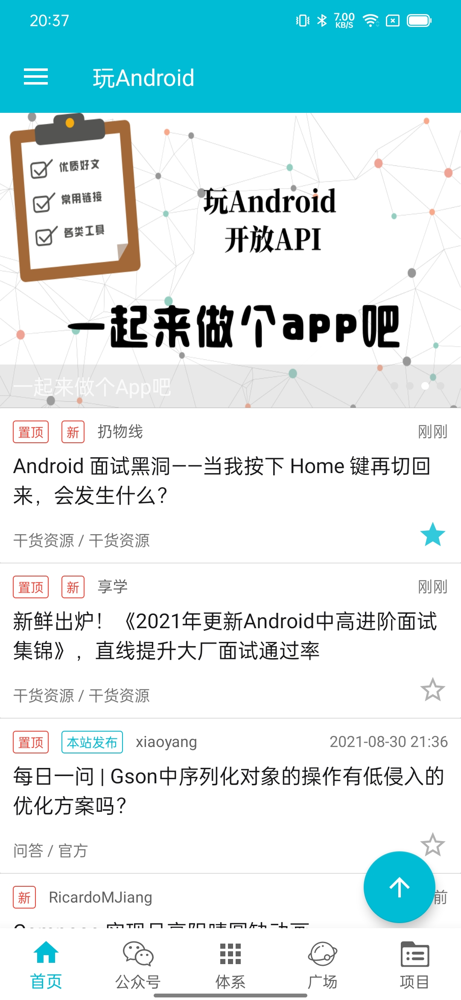
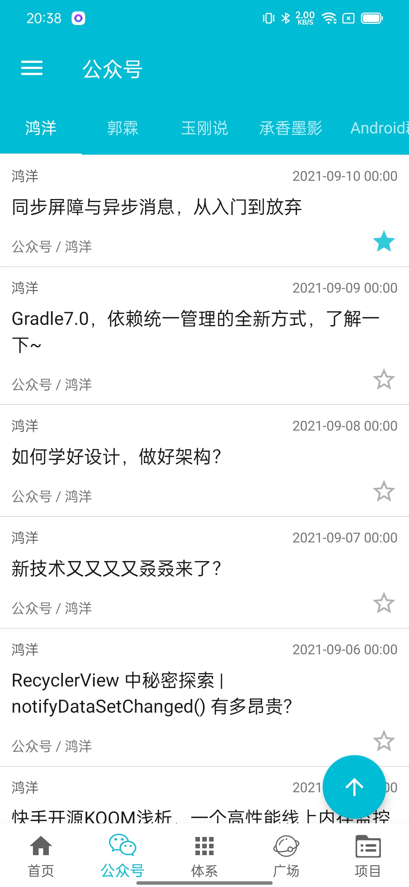
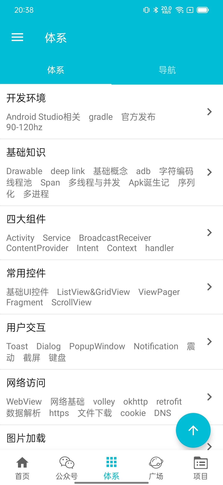
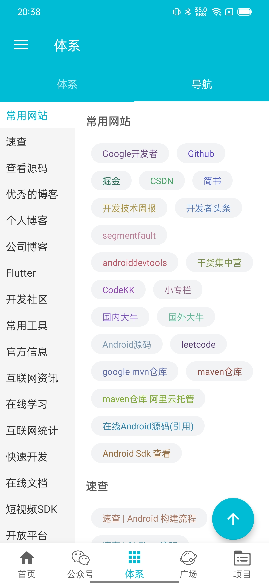
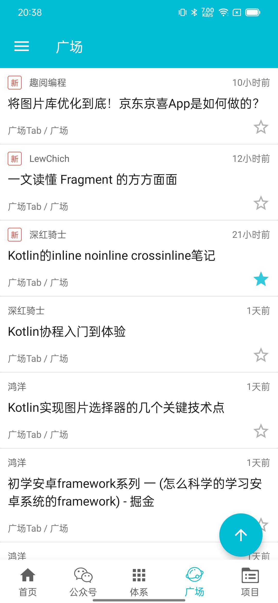
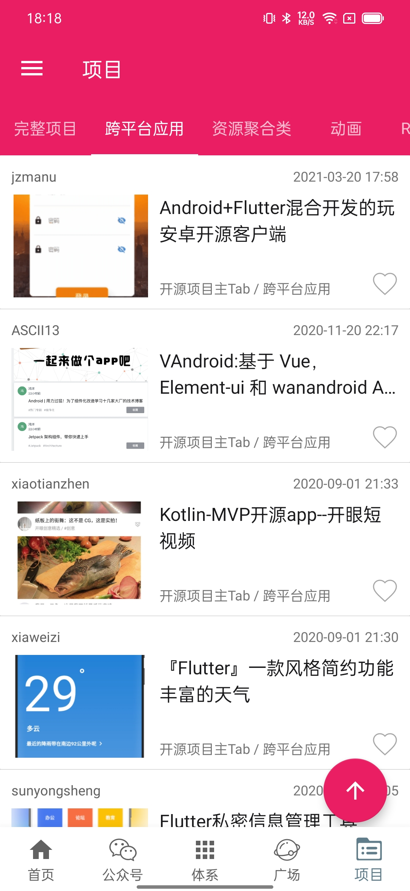

[toc]
# WanAndroid
🔥 🔥 🔥 一个充满设计感的WanAndroid APP，采用Kotlin 语言，组件化开发，MVVM+JetPack架构设计，**Arouter**、**LiveData**、**ViewModel**、**Room**、**Retrofit2**、**协程Coroutines**、**Flow**等流行技术。

## API
[**玩 Android 开放 API**](http://www.wanandroid.com/blog/show/2)

## 项目截图

|  |  |  |
| --- | --- | --- |
|  |  |  |


## 项目说明

### 项目目录及架构
1. 将该项目clone到本地的时候，需要在项目根目录下面添加**gradle.properties**文件，文件内容如下：
```class
org.gradle.jvmargs=-Xmx2048m -Dfile.encoding=UTF-8   
android.useAndroidX=true   
android.enableJetifier=true   
kotlin.code.style=official
```
2. 通用依赖库在common文件夹下，子组件都在modules文件夹下面。
3. 控制子组件单独运行的开关在根目录下的**config.gradle**文件里面。
4. 整个项目结构清晰简单，将每个tab做成一个module，让你快速上手组件化知识。
5. 那如何将一个tab当成一个module的呢？具体是怎么实现的呢？具体代码可以查看MainActivity里面的写法。
6. 该项目主要是学习如何将项目拆分module，是为了拆分module而拆分，实际项目中需要根据业务去拆分module。
7. **login模块和content模块由于改动较小，所以将这两个模块已上传到maven上面；APP壳工程既可以源码依赖，也可以aar依赖。**

### 子组件独立运行
*由于项目中使用到有Hilt注解，因此需要在子组件的Application添加@HiltAndroidApp注解；但是当子组件合并到APP主工程的时候，由于RootApplication也有@HiltAndroidApp注解，就会导致编译不通过；因此在将子组件合并到APP主工程的时候，需要移除子组件的@HiltAndroidApp注解*

### 网络请求框架使用:
1. Retrofit2 + 协程Coroutines + Flow技术搭建，因此每个模块都有涉及。
2. 该网络请求框架同时支持多个BaseUrl以及动态改变BaseUrl；如果使用的网络接口的baseUrl不是http://www.wanandroid.com 则直接在Retrofit注解上写上完整的请求接口地址即可。具体的实现方式是自定义拦截器，将旧的baseUrl替换成新的即可，
详情可见：**MultiBaseUrlInterceptor**

### Room:
1. 使用到Room的模块主要是module-project模块，涉及到Room的增删改查，定义关联表等知识。
2. 在组件化的情况下，如果某个子组件需要用到数据库，就不要和其他的组件或app工程使用同一个DB；如果这样就会出现耦合，其实如果某个子组件需要用到DB，那么就要为该组件定义一个DB；因为从业务上来讲，该业务被划成子组件，就和其他组件关系不大，因此需要一个独立的DB。

### composeUI:
module-compose模块使用的是compose开发的界面，主要用来学习compose

### Hilt:
1. 组件化使用Hilt，需要在主工程和子module中加入hilt相关依赖
2. ViewModel中使用@HiltViewModel注解，则在Fragment或者Activity中无法只用Inject来实例化ViewModel，具体实例化方法参考@HiltViewModel注解注释的内容
3. ViewModel中使用@HiltViewModel注解，是使用HiltViewModelFactory来创建ViewModel实例，提供了灵活性
4. ViewModel中使用@ActivityRetainedScoped注解，则在Fragment或者Activity中直接用Inject来实例化ViewModel

## 一些知识点
1. 使用Flow，不管是请求网络返回数据还是从DB中返回数据的时候，已经处于main线程了；网络请求和从DB中查询数据操作是在子线程。

## Arouter使用

#### 1. 使用room之后，组件化操作的时候，如果子module有数据存储需求，由于AppDatabase在主module中，则处理方式有两种：
1.1 在service模块，提供方法的时候，将对应的bean转为string，然后在子module中调用service提供的方法的时候，将获取到的数据转为string即可
1.2 在service模块，提供方法的时候，定义相应的bean即可
1.3 以上做法其实比较耦合，如果子module有数据存储需求，其实应该子module应该有一个单独的db。

#### 2. 每个模块需要有
```class
kapt {
    arguments {
        arg("AROUTER_MODULE_NAME", project.getName())
    }
    generateStubs = true
}
```

#### 3. 每个模块的路由路径的一级目录不能相同

#### 4. 传递参数的时候，参数名称不能是关键字。如：title

#### 5. 接收参数的时候，使用@Autowired注解的时候，变量不能被赋值

#### 6. 接收参数的时候，可以不使用@Autowired 注解，使用intent.extras 详见ContentActivity

#### 7. 不同module的布局文件存在同名的情况下，需要按照module的名称命名。
1. 比如登录模块的toolbar模块，命名为：reg_login_toolbar，content模块的toolbar命名为：content_toolbar

#### 8. 对提供的服务使用@Autowired注解获取实例的时候，不能是private，否则编译不通过

#### 9. 接上一条，在使用服务的实例的之前，需要调用
```class
ARouter.getInstance().inject(this)
```

## 疑问？
1. 如果新增一个module，或者新增一个功能，需要用到某个常量，然后主app也要用到某个该常量，那么该常量应该定义在哪里？base里面？如果定义在base里面，那么就会经常动base；如果不定义在base里面，那么该定义在哪里？

2. Arouter的路由应该放在哪里？如果放在common-base中，那么就要经常动base，如果放在某个module中，那么其他的module就无法使用，除非在该再定义一个相同的路由。

## 鼓励
通过这个项目希望能够帮助大家更好地学习 Jetpack 与 MVVM 架构。欢迎您提出项目架构设计中设计不合理的地方或者提出更优的解决方案，大家共同进步。如果你喜欢 WanAndroid的设计，感觉本项目的源代码对你的学习有所帮助，可以点右上角 "Star" 支持一下，谢谢！^_^

## 主要开源框架


 - [Retrofit](https://github.com/square/retrofit)
 - [okhttp](https://github.com/square/okhttp)
 - [Glide](https://github.com/bumptech/glide)
 - [BRVH](https://github.com/CymChad/BaseRecyclerViewAdapterHelper)
 - [Logger](https://github.com/orhanobut/logger)
 - [AgentWeb](https://github.com/Justson/AgentWeb)
 - [BGABanner-Android](https://github.com/bingoogolapple/BGABanner-Android)
 - [XXPermissions](https://github.com/getActivity/XXPermissions)
 - [Arouter](https://github.com/alibaba/ARouter)


## LICENSE

```
Copyright (C) bbgo, Open source codes for study only.
Do not use for commercial purpose.

Licensed under the Apache License, Version 2.0 (the "License");
you may not use this file except in compliance with the License.
You may obtain a copy of the License at

http://www.apache.org/licenses/LICENSE-2.0

Unless required by applicable law or agreed to in writing, software
distributed under the License is distributed on an "AS IS" BASIS,
WITHOUT WARRANTIES OR CONDITIONS OF ANY KIND, either express or implied.
See the License for the specific language governing permissions and
limitations under the License.
```